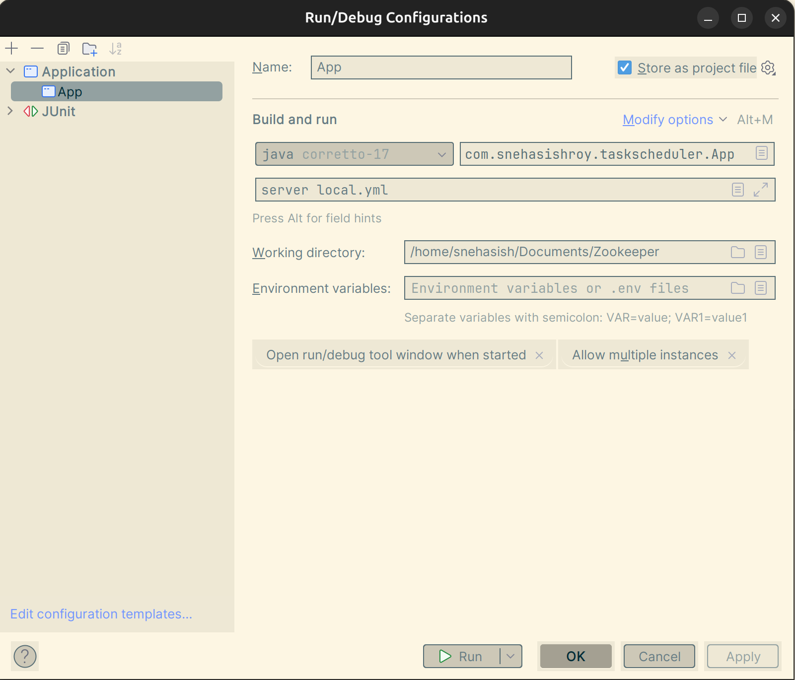

# Task Scheduler

The goal of this project is to provide a hands-on guide on building a scalable, distributed, fault-tolerant, task
scheduler platform using Zookeeper in Java.

## Maven Dependency

Use the following maven dependency

```
<dependency>
    <groupId>com.snehasishroy</groupId>
    <artifactId>TaskScheduler</artifactId>
    <version>1.0</version>
</dependency>
```

## Starting Zookeeper Server

This service utilizes TTL Nodes which requires Zookeeper Server >= 3.5.4.

It also requires the `extendedTypesEnabled` to be set while starting the ZK Server.

```
vim {ZK}/bin/zkEnv.sh

export SERVER_JVMFLAGS="-Xmx${ZK_SERVER_HEAP}m $SERVER_JVMFLAGS -Dzookeeper.extendedTypesEnabled=true"
```

Sample `zoo.cfg`

```
tickTime = 200
dataDir = /data/zookeeper
clientPort = 2181
initLimit = 5
syncLimit = 2
```

Starting the ZK Server

```
sudo ./zkServer.sh start-foreground
```

## Tools for Zookeeper Visualization

https://github.com/elkozmon/zoonavigator

  

## Running application

```
Main class: com.snehasishroy.taskscheduler.App
Arguments: server local.yml
```

If you want to run multiple instances of the application, just change both the ports present in `local.yml` and run the
application.



## Architecture


## Low level System Design

https://snehasishroy.com/build-a-distributed-task-scheduler-using-zookeeper

### What do we want?

We want to create a Task Execution Service that can execute tasks in a fault-tolerant manner. The service should
dynamically discover workers and assign tasks to them. If a worker dies while executing a task, the service should be
able to find that a worker has died (*or stopped responding*) and reassign the task to a new worker, providing at least
once guarantee for job execution. All these should be done in a highly scalable and distributed manner.

This will be a *hands-on guide* on implementing a distributed job execution service - so get your coffee mug ready.

<div data-node-type="callout">
<div data-node-type="callout-emoji">💡</div>
<div data-node-type="callout-text">The code used in this article can be found here <a target="_blank" rel="noopener noreferrer nofollow" href="https://github.com/snehasishroy/TaskScheduler" style="pointer-events: none">https://github.com/snehasishroy/TaskScheduler</a></div>
</div>

### Architecture

* Clients submit job details to Zookeeper and listen to the status updates again via Zookeeper.

* Multiple worker instances utilizes Zookeeper to perform leader election.

* The leader instances watches job path to listen for upcoming job and assigns the jobs to the available workers.

* The worker instances watches their assignment mapping path. When a new job is found, it gets executed and the
  completion status is updated.

* The client instances gets notified upon task completion by Zookeeper.

### Zookeeper

Zookeeper is a robust service that aims to **deliver coordination among distributed systems.** It's widely used in
open-source projects like Kafka and HBase as the central coordination service.

We will use CuratorFramework in our project as it provides high-level API's for interacting with Zookeeper.

> This blog won't deep dive into the internals of Zookeeper. Readers are expected to know the basics of Zookeeper before
> proceeding to the implementation part.

### Implementation Details

Let's look at the `ClientResource` - which provides a facade for task submission.

```java

@Slf4j
@Path("/v1/client")
public class Client {
    private final ClientService clientService;

    @Inject
    public Client(CuratorFramework curator) {
        this.clientService = new ClientService(curator);
    }

    @POST
    public String createSumTask(@QueryParam("first") int a, @QueryParam("second") int b) {
        Runnable jobDetail =
                (Runnable & Serializable)
                        (() -> System.out.println("Sum of " + a + " and " + b + " is " + (a + b)));
        return clientService.registerJob(jobDetail);
    }
}
```

The above code, allows clients to submit a sample runnable task that computes the sum of two numbers and prints it -
this provides an easy way for input via Swagger. But the design is extensible - the client can submit any instance of
the `Runnable` as a Job.

> Instead of providing a <code>Runnable</code>, we could have designed our service to work with <code>
> Dockerfile</code> - leading to a generic task execution system! but we wanted to focus only on Zookeeper in this
> article.

Now let's look at the `ClientService`

```java
public class ClientService {
    private final CuratorFramework curator;

    public ClientService(CuratorFramework curator) {
        this.curator = curator;
    }

    public String registerJob(Runnable jobDetail) {
        String jobId = UUID.randomUUID().toString();
        syncCreate(ZKUtils.getJobsPath() + "/" + jobId, jobDetail);
        return jobId;
    }

    private void syncCreate(String path, Runnable runnable) {
        // create the ZNode along with the Runnable instance as data
        try {
            ByteArrayOutputStream byteArrayOutputStream = new ByteArrayOutputStream();
            ObjectOutputStream objectOutputStream = new ObjectOutputStream(byteArrayOutputStream);
            objectOutputStream.writeObject(runnable);
            curator
                    .create()
                    .idempotent()
                    .withMode(CreateMode.PERSISTENT)
                    .forPath(path, byteArrayOutputStream.toByteArray());
        } catch (Exception e) {
            log.error("Unable to create {}", path, e);
            throw new RuntimeException(e);
        }
    }
}
```

Once a job is registered, a unique ID is assigned to it and a **Persistent** node is registered on the Zookeeper with
the randomly generated job ID in the path e.g. `/jobs/{job-id}`. Do notice that the `runnable` is serialized to a byte
array and stored in the ZNode directly.

Notice that we are creating the ZNode *synchronously* i.e. the function `syncCreate` will block until the ZNode is not
created. In the later section, you will notice that we have used asynchronous operations to improve throughput.

Why are we creating paths? So that we can set up *watches* on it. Watches allow us to be notified of any changes under
the watched path. Zookeeper will invoke the `JobsListener` whenever a new node is *created or destroyed* under
the `/jobs` path.

> What would happen if the client is disconnected from the Zookeeper when a new job is registered? In such cases, the
> watch won't be triggered and the client won't be notified. The Curator will automatically attempt to recreate the
> watches upon reconnection.

```java
public class JobsListener implements CuratorCacheListener {
    private final CuratorFramework curator;
    private final CuratorCache workersCache;
    private final ExecutorService executorService;
    private final WorkerPickerStrategy workerPickerStrategy;

    public JobsListener(
            CuratorFramework curator,
            CuratorCache workersCache,
            WorkerPickerStrategy workerPickerStrategy) {
        this.curator = curator;
        this.workersCache = workersCache;
        executorService = Executors.newSingleThreadExecutor();
        this.workerPickerStrategy = workerPickerStrategy;
    }

    @Override
    public void event(Type type, ChildData oldData, ChildData data) {
        if (type == Type.NODE_CREATED && data.getPath().length() > ZKUtils.JOBS_ROOT.length()) {
            String jobID = ZKUtils.extractNode(data.getPath());
            log.info("found new job {}, passing it to executor service", jobID);
            // an executor service is used in order to avoid blocking the watcher thread as the job
            // execution can be time consuming
            // and we don't want to skip handling new jobs during that time
            executorService.submit(
                    new JobAssigner(jobID, data.getData(), curator, workersCache, workerPickerStrategy));
        }
    }
}
```

When a new job is found, we hand over the Job ID to a different thread because we don't want to block the watcher
thread.

> All ZooKeeper watchers are serialized and processed by a single thread. Thus, no other watchers can be processed while
> your watcher is running. Hence it's vital not to block the watcher
>
thread. <a target="_blank" rel="noopener noreferrer nofollow" href="https://cwiki.apache.org/confluence/display/CURATOR/TN1" style="pointer-events: none">https://cwiki.apache.org/confluence/display/CURATOR/TN1</a>

We are setting up the watcher using `CuratorCache` - which will be explained later on.

---

### JobAssigner

Once a job has been created, we need to execute it by finding an eligible worker based on a strategy. We can either
choose a worker randomly or in a round-robin manner. Once a worker is chosen, we need to create an assignment between a
JobID and a Worker ID - we do so by creating a Persistent ZNode on the path `/assignments/{worker-id}/{job-id}` . Once
the assignment is created, we *delete* the `/jobs/{job-id}` path.

> Deletion of job details of the assigned job eases the recoverability. If a leader dies and a new leader is elected, it
> does not have to look at all the jobs present under <code>/jobs/</code> and figure out which one is left unassigned.
> Any
> jobs present under<code>/jobs/</code> are <em>guaranteed</em> to be unassigned - assuming that the assignment and
> deletion have happened <em>atomically</em>.

```java
public class JobAssigner implements Runnable {

    private final CuratorFramework curator;
    private final String jobID;
    private final CuratorCache workersCache;
    private final WorkerPickerStrategy workerPickerStrategy;
    private final byte[] jobData;
    private String workerName;

    public JobAssigner(
            String jobID,
            byte[] jobData,
            CuratorFramework curator,
            CuratorCache workersCache,
            WorkerPickerStrategy workerPickerStrategy) {
        this.jobID = jobID;
        this.curator = curator;
        this.workersCache = workersCache;
        this.workerPickerStrategy = workerPickerStrategy;
        this.jobData = jobData;
    }

    @Override
    public void run() {
        // from the list of workers, pick a worker based on the provided strategy and assign the
        // incoming job to that worker
        List<ChildData> workers =
                workersCache.stream()
                        .filter(childData -> (childData.getPath().length() > ZKUtils.WORKERS_ROOT.length()))
                        .toList();
        ChildData chosenWorker = workerPickerStrategy.evaluate(workers);
        workerName = ZKUtils.extractNode(chosenWorker.getPath());
        log.info(
                "Found total workers {}, Chosen worker index {}, worker name {}",
                workers.size(),
                chosenWorker,
                workerName);
        asyncCreateAssignment();
    }

    private void asyncCreateAssignment() {
        try {
            curator
                    .create()
                    .idempotent()
                    .withMode(CreateMode.PERSISTENT)
                    .inBackground(
                            new BackgroundCallback() {
                                @Override
                                public void processResult(CuratorFramework client, CuratorEvent event) {
                                    switch (KeeperException.Code.get(event.getResultCode())) {
                                        case OK -> {
                                            log.info(
                                                    "Assignment created successfully for JobID {} with WorkerID {}",
                                                    jobID,
                                                    workerName);
                                            log.info(
                                                    "Performing async deletion of {}", ZKUtils.getJobsPath() + "/" + jobID);
                                            asyncDelete(ZKUtils.getJobsPath() + "/" + jobID);
                                        }
                                        case CONNECTIONLOSS -> {
                                            log.error(
                                                    "Lost connection to ZK while creating {}, retrying", event.getPath());
                                            asyncCreateAssignment();
                                        }
                                        case NODEEXISTS -> {
                                            log.warn("Assignment already exists for path {}", event.getPath());
                                        }
                                        case NONODE -> {
                                            log.error("Trying to create an assignment for a worker which does not exist {}", event);
                                        }
                                        default -> log.error("Unhandled event {} ", event);
                                    }
                                }
                            })
                    .forPath(ZKUtils.ASSIGNMENT_ROOT + "/" + workerName + "/" + jobID, jobData);
            // Storing the job data along with the assignment, so that the respective worker need not
            // perform an additional call to get the job details.
            // This also simplifies the design - because we can delete the /jobs/{jobID} path once the
            // assignment  is completed - indicating that if an entry is present under /jobs, it's
            // assignment is not yet done.
            // This makes the recovery/reconciliation process much easier. Once a leader is elected, it
            // has to only perform liveliness check for the existing assignments.
            // TODO: Use MultiOp to perform assignment and deletion atomically
        } catch (Exception e) {
            log.error("Error while creating assignment for {} with {}", jobID, workerName, e);
            throw new RuntimeException(e);
        }
    }

    private void asyncDelete(String path) {
        // delete the provided ZNode
        try {
            curator
                    .delete()
                    .idempotent()
                    .guaranteed()
                    .inBackground(
                            new BackgroundCallback() {
                                @Override
                                public void processResult(CuratorFramework client, CuratorEvent event) {
                                    switch (KeeperException.Code.get(event.getResultCode())) {
                                        case OK -> {
                                            log.info("Path deleted successfully {}", event.getPath());
                                        }
                                        case CONNECTIONLOSS -> {
                                            log.info(
                                                    "Lost connection to ZK while deleting {}, retrying", event.getPath());
                                            asyncDelete(event.getPath());
                                        }
                                        default -> log.error("Unhandled event {}", event);
                                    }
                                }
                            })
                    .forPath(path);
        } catch (Exception e) {
            log.error("Unable to delete {} due to ", path, e);
            throw new RuntimeException(e);
        }
    }
}
```

> We are using asynchronous operations to create a ZNode to increase throughput. Being asynchronous, we don't know
> whether our operation actually succeeded or not, hence we have to deal with failure scenarios i.e. <code>
> ConnectionLoss</code> and whether the Node already exists.

### WorkerPickerStrategy

We are using `Strategy` pattern to dynamically change the way we can choose a worker at runtime. The important thing to
notice is that we have used *compare and swap* as a way to perform optimistic locking for `RoundRobinWorker` .

```java
public interface WorkerPickerStrategy {
    ChildData evaluate(List<ChildData> workers);
}

// choose workers based on random strategy
public class RandomWorker implements WorkerPickerStrategy {
    @Override
    public ChildData evaluate(List<ChildData> workers) {
        int chosenWorker = (int) (Math.random() * workers.size());
        return workers.get(chosenWorker);
    }
}

// choose workers based on round robin strategy
public class RoundRobinWorker implements WorkerPickerStrategy {
    AtomicInteger index =
            new AtomicInteger(0); // atomic because this will be accessed from multiple threads

    @Override
    public ChildData evaluate(List<ChildData> workers) {
        int chosenIndex;
        while (true) { // repeat this until compare and set operation is succeeded
            chosenIndex = index.get();
            int nextIndex = (chosenIndex + 1) < workers.size() ? (chosenIndex + 1) : 0;
            // in case of concurrent updates, this can fail, hence we have to retry until success
            if (index.compareAndSet(chosenIndex, nextIndex)) {
                break;
            }
        }
        return workers.get(chosenIndex);
    }
}
```

> Optimistic locking is a very powerful construct and can be found in various places e.g. ElasticSearch natively
> provides compare and swap operations while updating documents. Zookeeper also maintains a version number with each
> ZNode - which can be used to perform a conditional
>
update. <a target="_blank" rel="noopener noreferrer nofollow" href="https://www.elastic.co/guide/en/elasticsearch/reference/current/optimistic-concurrency-control.html" style="pointer-events: none">https://www.elastic.co/guide/en/elasticsearch/reference/current/optimistic-concurrency-control.html</a><a target="_blank" rel="noopener noreferrer nofollow" href="https://zookeeper.apache.org/doc/current/zookeeperProgrammers.html" style="pointer-events: none">https://zookeeper.apache.org/doc/current/zookeeperProgrammers.html</a>

---

### WorkerService

Since the `JobHandler` creates an assignment using ZNode of form `/assignments/{worker-id}/{job-id}` , if a worker has
to listen to upcoming assignments, a watch needs to be set on the `/assignments/{worker-id}` path.

Once the worker service is notified of the new assignment, it fetches the job details, deserializes it to an instance of
Runnable, and passes it to an `ExecutorService` which performs the execution.

Once the runnable has been executed, we chain the future by updating the status of the job id. The status of a job ID is
reflected by *asynchronously* creating an entry in `/status/{job-id}` . Once the entry is created, we perform the last
operation in this orchestra - deletion of the assignment mapping.


> We have deliberately chosen the deletion of the assignment mapping as the last operation. In case, a worker dies
> during task execution, the leader can perform failure recovery and assign all the tasks that the dead worker was
> assigned, to a new worker instance.

```java
public class AssignmentListener implements CuratorCacheListener {
    private final CuratorFramework curator;
    private final ExecutorService executorService;

    public AssignmentListener(CuratorFramework curator) {
        this.curator = curator;
        this.executorService = Executors.newFixedThreadPool(10);
    }

    @Override
    public void event(Type type, ChildData oldData, ChildData data) {
        if (type == Type.NODE_CREATED) {
            if (data.getPath().indexOf('/', 1) == data.getPath().lastIndexOf('/')) {
                // This filters out the root path /assignment/{worker-id} which does not contains any job id
                return;
            }
            String jobId = data.getPath().substring(data.getPath().lastIndexOf('/') + 1);
            log.info("Assignment found for job id {}", jobId);

            try {
                byte[] bytes = data.getData();
                ObjectInputStream objectInputStream =
                        new ObjectInputStream(new ByteArrayInputStream(bytes));
                Runnable jobDetail = (Runnable) objectInputStream.readObject();
                log.info("Deserialized the JobId {} to {}", jobId, jobDetail);
                CompletableFuture<Void> future = CompletableFuture.runAsync(jobDetail, executorService);
                // Actual execution of the job will be performed in a separate thread to avoid blocking of
                // watcher thread
                log.info("Job submitted for execution");
                // once the job has been executed, we need to ensure the assignment is deleted and the
                // status of job has been updated. Currently there is no guarantee that post the execution,
                // this cleanup happens.
                // TODO: Implement a daemon service which performs cleanup
                future.thenAcceptAsync(__ -> asyncCreate(jobId, data.getPath()), executorService);
            } catch (Exception e) {
                log.error("Unable to fetch data for job id {}", jobId, e);
            }
        }
    }

    private void asyncCreate(String jobId, String assignmentPath) {
        log.info("JobID {} has been executed, moving on to update its status", jobId);
        // create the ZNode, no need to set any data with this znode
        try {
            curator
                    .create()
                    .withTtl(ZKUtils.STATUS_TTL_MILLIS)
                    .creatingParentsIfNeeded()
                    .withMode(CreateMode.PERSISTENT_WITH_TTL)
                    .inBackground(
                            new BackgroundCallback() {
                                @Override
                                public void processResult(CuratorFramework client, CuratorEvent event) {
                                    switch (KeeperException.Code.get(event.getResultCode())) {
                                        case OK -> {
                                            log.info("Status updated successfully {}", event.getPath());
                                            log.info("Performing deletion of assignment path {}", assignmentPath);
                                            asyncDelete(assignmentPath);
                                        }
                                        case CONNECTIONLOSS -> {
                                            log.error(
                                                    "Lost connection to ZK while creating {}, retrying", event.getPath());
                                            asyncCreate(jobId, assignmentPath);
                                        }
                                        case NODEEXISTS -> {
                                            log.warn("Node already exists for path {}", event.getPath());
                                        }
                                        default -> log.error("Unhandled event {}", event);
                                    }
                                }
                            })
                    .forPath(ZKUtils.getStatusPath(jobId), "Completed".getBytes());
        } catch (Exception e) {
            log.error("Unable to create {} due to ", ZKUtils.getStatusPath(jobId), e);
            throw new RuntimeException(e);
        }
    }

    private void asyncDelete(String path) {
        // delete the provided ZNode
        try {
            curator
                    .delete()
                    .idempotent()
                    .guaranteed()
                    .inBackground(
                            new BackgroundCallback() {
                                @Override
                                public void processResult(CuratorFramework client, CuratorEvent event) {
                                    switch (KeeperException.Code.get(event.getResultCode())) {
                                        case OK -> {
                                            log.info("Path deleted successfully {}", event.getPath());
                                        }
                                        case CONNECTIONLOSS -> {
                                            log.info(
                                                    "Lost connection to ZK while deleting {}, retrying", event.getPath());
                                            asyncDelete(event.getPath());
                                        }
                                        default -> log.error("Unhandled event {}", event);
                                    }
                                }
                            })
                    .forPath(path);
        } catch (Exception e) {
            log.error("Unable to delete {} due to ", path, e);
            throw new RuntimeException(e);
        }
    }
}
```

### WorkersListener

When a worker is lost due to network partition, or application shutdown, the leader instance is notified using a watcher
event. The leader then looks at all the tasks that were assigned to the lost worker by iterating over the assignment
mappings `/assignment/{worker-id}/{job-id}` .

All the tasks are then recreated by re-creating an entry in the `/jobs/{job-id}` . This recreation triggers the entire
workflow from the start.

```java
public class WorkersListener implements CuratorCacheListener {

    private final CuratorCache assignmentCache;
    private final CuratorFramework curator;

    public WorkersListener(CuratorCache assignmentCache, CuratorFramework curator) {
        this.assignmentCache = assignmentCache;
        this.curator = curator;
    }

    @Override
    public void event(Type type, ChildData oldData, ChildData data) {
        if (type == Type.NODE_CREATED) {
            log.info("New worker found {} ", data.getPath());
        } else if (type == Type.NODE_DELETED) {
            // notice we have to check oldData because data will be null
            log.info("Lost worker {}", oldData.getPath());
            String lostWorkerID = oldData.getPath().substring(oldData.getPath().lastIndexOf('/') + 1);
            // map of job ids -> job data, which was assigned to the lost worker
            Map<String, byte[]> assignableJobIds = new HashMap<>();
            assignmentCache.stream()
                    .forEach(
                            childData -> {
                                String path = childData.getPath();
                                int begin = path.indexOf('/') + 1;
                                int end = path.indexOf('/', begin);
                                String pathWorkerID = path.substring(begin, end);
                                if (pathWorkerID.equals(lostWorkerID)) {
                                    String jobID = path.substring(end + 1);
                                    log.info("Found {} assigned to lost worker {}", jobID, lostWorkerID);
                                    assignableJobIds.put(jobID, childData.getData());
                                }
                            });
            // Assuming atomic creation of assignment path and deletion of tasks path (using MultiOp), we
            // can safely assume that no entry exists under /jobs for the assigned tasks.
            // So we can simulate job creation by recreating an entry in the /jobs entry.
            assignableJobIds.forEach(
                    (jobId, jobData) -> asyncCreateJob(ZKUtils.getJobsPath() + "/" + jobId, jobData));
        }
    }

    private void asyncCreateJob(String path, byte[] data) {
        try {
            curator
                    .create()
                    .idempotent()
                    .withMode(CreateMode.PERSISTENT)
                    .inBackground(
                            new BackgroundCallback() {
                                @Override
                                public void processResult(CuratorFramework client, CuratorEvent event) {
                                    switch (KeeperException.Code.get(event.getResultCode())) {
                                        case OK -> {
                                            log.info("Job repaired successfully for {}", path);
                                        }
                                        case CONNECTIONLOSS -> {
                                            log.error(
                                                    "Lost connection to ZK while repairing job {}, retrying",
                                                    event.getPath());
                                            asyncCreateJob(event.getPath(), (byte[]) event.getContext());
                                        }
                                        case NODEEXISTS -> {
                                            log.warn("Job already exists for path {}", event.getPath());
                                        }
                                        default -> log.error("Unhandled event {}", event);
                                    }
                                }
                            },
                            data)
                    .forPath(path, data);
        } catch (Exception e) {
            log.error("Error while repairing job {}", path, e);
            throw new RuntimeException(e);
        }
    }
}
```

### WorkerService - The humble plumber

Throughout the article, you might have noticed that we talked about a leader instance performing some work but never
explained it. So let's talk about what a leader instance is and how an instance becomes a leader.

When a worker instance comes up - it enqueues itself for a chance to become a leader. We perform leader elections using
the Curator framework ensuring that only a single instance can become a leader amongst the members.

The leader is entrusted to perform critical actions like watching the `/jobs/` path and the `/workers/` path. *The
remaining instances do not set up watches on these paths because we want to ensure a task is assigned to only one worker
instance*. If multiple instances were trying to perform the assignment, it would be difficult to coordinate among them
without taking a lock. This is where the Zookeeper comes in and acts as the trusty coordination service.

```java
public class WorkerService implements LeaderSelectorListener, Closeable {
  public WorkerService(CuratorFramework curator, String path) {
    this.curator = curator;
    leaderSelector = new LeaderSelector(curator, path, this);
    // the selection for this instance doesn't start until the leader selector is started
    // leader selection is done in the background so this call to leaderSelector.start() returns
    // immediately
    leaderSelector.start();
    // this is important as it automatically handles failure scenarios i.e. starts leadership after
    // the reconnected state
    // https://www.mail-archive.com/user@curator.apache.org/msg00903.html
    leaderSelector.autoRequeue();
    setup();
    workerPickerStrategy = new RoundRobinWorker();
  }

  private void setup() {
    registerWorker();
    asyncCreate(ZKUtils.getJobsPath(), CreateMode.PERSISTENT, null);
    asyncCreate(ZKUtils.getAssignmentPath(name), CreateMode.PERSISTENT, null);
    asyncCreate(ZKUtils.STATUS_ROOT, CreateMode.PERSISTENT, null);
  }

  private void registerWorker() {
    if (registrationRequired.get()) {
      log.info("Attempting worker registration");
      name = UUID.randomUUID().toString();
      log.info("Generated a new random name to the worker {}", name);
      asyncCreate(ZKUtils.getWorkerPath(name), CreateMode.EPHEMERAL, registrationRequired);
      asyncCreate(ZKUtils.getAssignmentPath(name), CreateMode.PERSISTENT, null);
      watchAssignmentPath();
      // irrespective of whether this node is a leader or not, we need to watch the assignment path
    }
  }

  // only the leader worker will watch for incoming jobs and changes to available workers
  private void watchJobsAndWorkersPath() {
    // in case leadership is reacquired, repeat the setup of the watches
    workersCache = CuratorCache.build(curator, ZKUtils.WORKERS_ROOT);
    workersCache.start();
    log.info("Watching workers root path {}", ZKUtils.WORKERS_ROOT);
    workersListener = new WorkersListener(assignmentCache, curator);
    workersCache.listenable().addListener(workersListener);

    jobsCache = CuratorCache.build(curator, ZKUtils.JOBS_ROOT);
    log.info("Watching jobs root path {}", ZKUtils.getJobsPath());
    jobsCache.start();
    jobsListener = new JobsListener(curator, workersCache, workerPickerStrategy);
    jobsCache.listenable().addListener(jobsListener);
  }

  private void watchAssignmentPath() {
    // No need to check for null here because once a session is reconnected after a loss
    // we need to start the assignment listener on the new worker id
    assignmentCache = CuratorCache.build(curator, ZKUtils.getAssignmentPath(name));
    log.info("Watching {}", ZKUtils.getAssignmentPath(name));
    assignmentCache.start();
    assignmentListener = new AssignmentListener(curator);
    assignmentCache.listenable().addListener(assignmentListener);
  }

  @Override
  public void takeLeadership(CuratorFramework client) {
    // we are now the leader. This method should not return until we want to relinquish leadership,
    // which will only happen, if someone has signalled us to stop
    log.info("{} is now the leader", name);
    // only the leader should watch the jobs and workers path
    watchJobsAndWorkersPath();
    lock.lock();
    try {
      // sleep until signalled to stop
      while (!shouldStop.get()) {
        condition.await();
      }
      if (shouldStop.get()) {
        log.warn("{} is signalled to stop!", name);
        leaderSelector.close();
      }
    } catch (InterruptedException e) { // this is propagated from cancel leadership election
      log.error("Thread is interrupted, need to exit the leadership", e);
    } finally {
      // finally is called before the method return
      lock.unlock();
    }
  }

  @Override
  public void stateChanged(CuratorFramework client, ConnectionState newState) {
    if (newState == ConnectionState.RECONNECTED) {
      log.error("Reconnected to ZK, Received {}", newState);
      // no need to start the leadership again as it is auto requeued but worker re-registration is
      // still required which will create a ZNode in /workers and /assignments path
      registerWorker();
    } else if (newState == ConnectionState.LOST) {
      log.error("Connection suspended/lost to ZK, giving up leadership {}", newState);
      registrationRequired.set(true);
      // This is required as the assignment cache listens on the {worker id} which is ephemeral
      // In case of a lost session, it's guaranteed that the {worker id} would have expired
      // Once the session is reconnected, we need to set up the assignment listener again on a new
      // worker id
      // TODO: Figure out a way to simulate the disconnection from zookeeper only by one instance
      log.info("Removing the watcher set on the assignment listener");
      assignmentCache.listenable().removeListener(assignmentListener);
      assignmentCache.close();
      if (workersCache != null) {
        log.info("Removing the watcher set on the workers listener");
        workersCache.listenable().removeListener(workersListener);
        workersCache.close();
      }
      if (jobsCache != null) {
        log.info("Removing the watcher set on the jobs listener");
        jobsCache.listenable().removeListener(jobsListener);
        jobsCache.close();
      }
      // throwing this specific exception would cause the current thread to interrupt and would
      // cause and InterruptedException
      throw new CancelLeadershipException();
    } else if (newState == ConnectionState.SUSPENDED) {
      // https://stackoverflow.com/questions/41042798/how-to-handle-apache-curator-distributed-lock-loss-of-connection
      log.error("Connection has been suspended to ZK {}", newState);
      // TODO: After increasing the time out, verify whether no other instance gets the lock before
      // the connection is marked as LOST
    }
  }
}

```

> It's critical for the <code>LeaderSelector</code> instances to pay attention to any connection state changes. If an
> instance becomes the leader, it should respond to notification of being SUSPENDED or LOST Zookeeper session. If the
> SUSPENDED state is reported, the instance must assume it might no longer be the leader until it receives a RECONNECTED
> state. If the LOST state is reported, the instance is no longer the leader and its <code>takeLeadership</code> method
> should exit.

When we detect that our instance has lost its connection from Zookeeper, we remove any watches that have been set up and
throw a `CancelLeadershipException`. And then we wait until we are reconnected to the Zookeeper.

Once reconnected, we generate a new name for the worker and set up appropriate watches. Since `autoRequeue()` was
enabled during the leader election, the instance will enqueue itself for a chance of becoming a leader.

---

### Conclusion


If you have read so far, I appreciate your patience. Hope you learnt something new today. Thank you for reading.

Please feel free to ask any questions you might have in the comments.

---

### Appendix

* [ZooKeeper watches are single-threaded.](https://cwiki.apache.org/confluence/display/CURATOR/TN1)

* [Link to the Code Repository](https://github.com/snehasishroy/TaskScheduler)